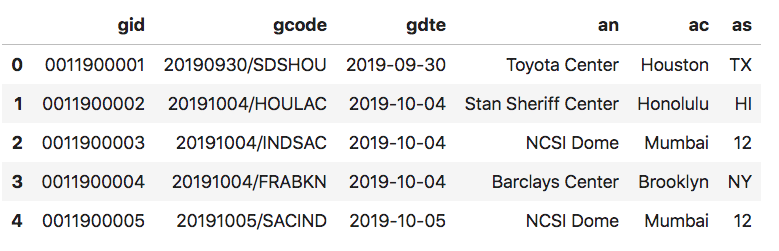
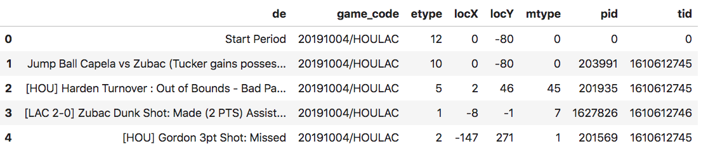
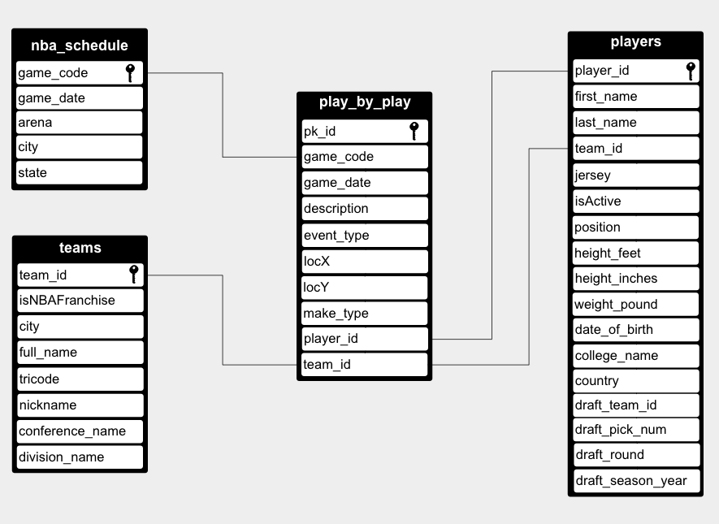
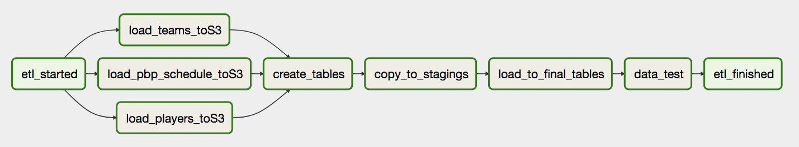
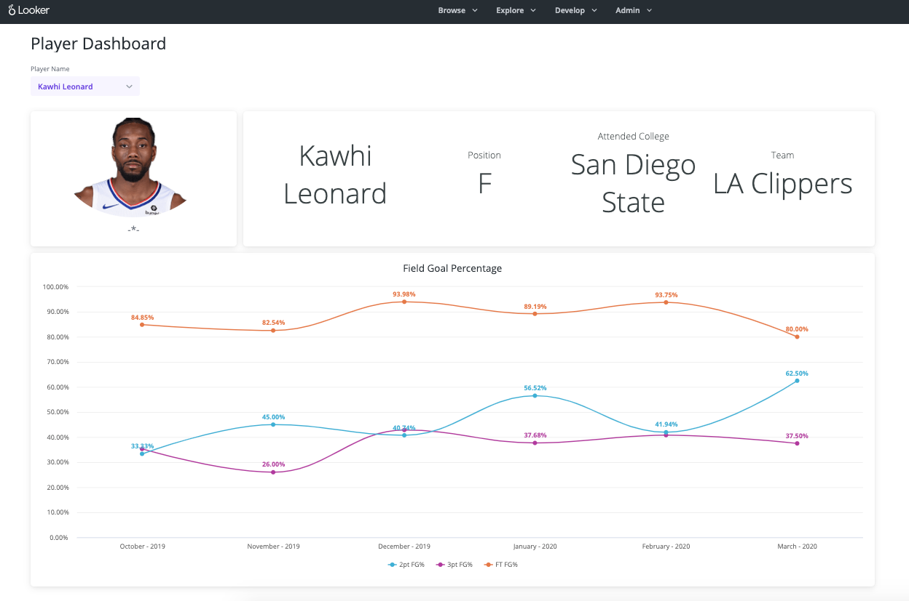

# Step 1: Scope the Project and Gather Data

As a final project of the Data Engineering Nanodegree, we will combine what we've learned throughout the program. We will gather data, design data models, create a data warehouse to store the data then build an ETL pipeline to load the data into tables.

The datasets will be downloaded from the Internet and come in nested JSON format that will be flatten to extract the columns needed for each table.
These datasets will create a source-of-truth database that will be used to write sport articles and TV shows.

# Step 2: Explore and Assess the Data

The data is stored in (nested) JSON format in different links. We need to construct the correct URL to pull the right data. Everything start by downloading the schedule of games for a season. For example, the schedule of the 2019 season would look like this:

`url_schedule = 'https://data.nba.com/data/10s/v2015/json/mobile_teams/nba/'+ str(season) +'/league/00_full_schedule_week.json'`

After transformation, the data is load in a S3 bucket in CSV format. Here’s an example of how the schedule data look like:



The game id (`gid`) from the schedule data is then used to construct the URL to extract the play by play data for a game.

`url_pbp = 'https://data.nba.com/data/10s/v2015/json/mobile_teams/nba/' + str(season) + '/scores/pbp/'+game_id+'_full_pbp.json'`

The example below shows the play by play data of one game.



The same logic is applied to download the player's data.

The teams data is saved in this S3 bucket: `s3://nba-6th-man/teams_info.json`

The data for schedule, play by play, players, and teams are transformed then loaded into a S3 bucket in CSV format. 

# Step 3: Define the Data Model



We decided to create a start schema optimized for queries on play by play analysis. This schema has the following tables:

**Dimension Tables**
1.	`nba_schedule` stores information about games
2.	`players holds` data about NBA players
3.	`teams` has information about NBA teams and international teams that played a game against an NBA team.

**Fact Table**

4.	`play_by_play` has data about each event that happened in a game like jump shots, miss free throw, rebounds, and so on.

 
Since the data will be stored in Redshift, we designed the `teams` and `players` tables in a way that each node will have a copy of the data while the data in the `nba_schedule` and `play_by_play` tables will be evenly distributed across nodes based on the game_date column.  We choose this design because we have few data in the teams and players tables while the nba_schedule would have, for example, 1173 games played in the 2019 season and one game in the play_by_play table can have 572 events (row of data). Also, by having the data on players and teams in each node we are improving the query performance by reducing the network traffic. 

We provide more detail on the steps necessary to pipeline the data into the data model in the next section.

# Step 4: Run ETL to Model the Data

We are using Apache Airflow to run our ETL pipeline. The advantage of Airflow is that we can visualize the DAG and if there's a task that fails we'll be able to focus on that specific task instead of not knowning why the ETL process failed. Here’s a screenshot of our pipeline:

The _etl_started_ and _etl_finished_ task in the pipeline are just dummy steps used to make the pipeline more readable.

- Step 1: Download NBA data, transform it to extract only columns needed then dump data in CSV format in S3 bucket. 
- Step 2: Create the tables where the data will be stored based on the data model. 
- Step 3: Copy the data from the CSV files to staging tables (staging_pbp, staging_schedule, staging_teams, staging_players).
- Step 4: From the staging tables, insert the data into the final tables (play_by_play, nba_schedule, teams, players).
- Step 5: Run data tests to check if the data was inserted correctly.

This ETL uses the following Python libraries:

```
os
sys
json
boto3
pandas
requests
psycopg2
configparser
```
Before starting the ETL process in Apache Airflow, we need to enter the missing information in the `aws.cfg` that should be in the `~/airflow/dags/ilaka_dag/etl` folder.

With the current configuration, The ETL should be run once a year to download the data of an entire season. However, we adapt the ETL so run daily, weekly, or monthly. For this we'll create a pipeline that append the data in the final tables (not droping the table) and create a schedule url link that will return the games that played yesterday, last week, or last month.

### Data Dictionary

**`Play_by_play`** : store information about each play that happened in a game

- `pk_id int IDENTITY(0,1)` Unique primary key, not null
- `game_code varchar` Each game must have a code composed of date and the tricode of teams playing
- `game_date DATE`  used to sort and distribute the data across nodes, cannot be null,
- `description varchar` describe each play (event),
- `event_type varchar` code of event stored in integer between 1 to 20,
- `locX int` X coordinate of player when the event happened,
- `locY int` Y coordinate of player when the event happened,
- `make_type varchar` code that indicate if a play was made or miss,
- `player_id varchar` the id of the player who’s involved in the play,
- `team_id varchar` the player’s ID team

**`nba_schedule`** : Stores schedule’s data for games

- `game_code varchar` Each game must have a code composed of date and the tricode of teams playing, this field is also the Primary key and should not be null,
- `game_date DATE` used to sort and distribute the data across nodes,
- `arena varchar` Name of the arena where the game was played,
- `city varchar` City where the game was played,
- `state varchar` State where the game was played.

**`teams`** : Stores information about NBA and international teams that had played a game Vs a NBA team

- `team_id varchar` Unique primary key, also used to sort the data, cannot be null,
- `isNBAFranchise Boolean` True or False if a team is an NBA franchise,
- `city varchar` The main city of the team,
- `full_name varchar` The full name of the team,
- `tricode char(3)` Three character that constitute the code of the team,
- `nickname varchar` The team’s nickname,
- `conference_name varchar` The conference where the team plays,
- `division_name varchar` The division where the team plays.

**`Players`**: stores information about the player

- `player_id varchar` Unique primary key, also used to sort the data, cannot be null,
-`first_name varchar` First name,
- `last_name varchar` Last name,
- `team_id varchar` The team where the player plays,
- `jersey varchar` The jersey number,
- `isActive varchar` True or False if the player is still active,
- `position varchar` Position played,
- `height_feet varchar` Height of player in feet,
- `height_inches varchar` Height of player in inches,
- `weight_pound varchar` weight of player in pound,
- `date_of_birth varchar` date of birth,
- `college_name varchar` College name that the player attended,
- `country varchar` Country of citizenship of the player,
- `draft_team_id varchar` The team ID that drafted the player,
- `draft_pick_num varchar` Draft pick number,
- `draft_round varchar` Draft round,
- `draft_season_year varchar` The season year that the player was drafted

# Step 5: Complete Project Write Up

A sport startup, **The 6th Man**, would like to serve NBA statistics to their customers who love basketball. The startup publishes TV talk shows, articles on internet and in magazines. Currently, they don’t have any data about the NBA and would like to bring onboard a Data Engineer who will oversee this project.
The man goal of the project is to build a pipeline that will collect data from the NBA official website, create a data warehouse that will be connected to a BI tool so that the analytics team will be able to run SQL queries against the database to extract the insight that would be used in publications.

Here are some examples queries that would be run by the analytics team:
-	Who are the top 5 players in terms of 3 points attempts and made?  
-	Who are the top 5 players in terms of 2 points attempts and made?  
-	Who are the most efficient players when taking a jump shot at 10, 15, 20 feet from the rim? 

As the data engineer of the startup, we decided to build an Amazon Redshift warehouse that will serve as a source-of-truth database. We chose Redshift for speed and scalability. The articles published on the Interned will use embeded analytics and the startup is anticapiting an exponential groth of customers who will be interacticting with the graphs and other reports in their articles. They wanted a database that will not crush when the workload increases and Redshift address this issue as it can execute queries in parallel and can also scale automatically (depending on the [configuration](https://aws.amazon.com/about-aws/whats-new/2019/09/amazon-redshift-announces-automatic-workload-management-and-query-priorities/)).
Another reason that we picked Redshift is that it's already in the cloud and most the articles will be published on Internet; thus, reducing (elimating) the hardware setup and maintenance costs. 

Another technology used in this project is Apache Airflow which gives us a great UI in the web browser to monitor our pipeline. This is handy for debugging what task in the pipeline failed. Another advantage of Airflow is the ability to schedule when our pipeline will run and the posibility to set the number of time it should try to run a failed task and eventually send an email if necessary. 

#### Other tools and technologies
- AWS S3 bucket: We use this technology to store the transformed data before loading it into the staging tables to make things convenient has we already decided to use Redshift. 
- Python: we used Python as the main programming language to write the code of files that contitute the ETL pipeline of this project. The advantage of Python is not only the wide range of libraries and modules that it has but also its community.

#### Other Scenarios

If the data was increased by 100x I would download all the data in JSON format directly into a S3 bucket then create an `EMR cluster` that will use Spark to transform the data then write the result in a parquet file. Finally, copy the data from the parquet file into Redshift. 

If the pipelines were run on a daily basis by 7am, I will set the value of the `schedule_interval` parameter in the `DAG` to equal to `0 7 * * *` so that the ETL process will get triggered every day at 7am.

If the database needed to be accessed by 100+ people, I will setup the Redshift cluster with auto-scaling for [concurrent](https://www.youtube.com/watch?v=-2yQsI9xJKQ) queries.

# Example of queries



This dashboard was built in [Looker](https://github.com/christelilaka/nba_project) based on the following queries:

__Return the Name of the player, the position that he plays, the college that he attended, and his current team__ 

```sql
SELECT
	play_by_play.player_id  AS "play_by_play.player_id",
	play_by_play.team_id  AS "play_by_play.team_id",
	players.first_name || ' ' || players.last_name  AS "players.full_name",
	players.position  AS "players.position",
	players.college_name  AS "players.college_name",
	teams.full_name  AS "teams.full_name"
FROM public.play_by_play  AS play_by_play
LEFT JOIN public.players  AS players ON play_by_play.player_id = players.player_id
LEFT JOIN public.teams  AS teams ON play_by_play.team_id = teams.team_id
WHERE (((players.first_name || ' ' || players.last_name) = 'Kawhi Leonard')) AND teams.isnbafranchise
GROUP BY 1,2,3,4,5,6
ORDER BY 1
LIMIT 500
```
__What is the 2 points, 3 points, and free throw field goal percentage for a pecific player?__

```sql
SELECT
	DATE_PART(month,play_by_play.game_date )::integer AS "play_by_play.game_month_num",
	TO_CHAR(play_by_play.game_date , 'FMMonth') AS "play_by_play.game_month_name",
	DATE_PART(year, play_by_play.game_date )::integer AS "play_by_play.game_year",
	(COUNT(CASE WHEN play_by_play.description LIKE '%Jump shot: Made%'  THEN 1 ELSE NULL END))*1.0/NULLIF((COUNT(CASE WHEN play_by_play.description LIKE '%Jump shot%'  THEN 1 ELSE NULL END)),0)  AS "play_by_play.field_goal_percentage_2pt",
	(COUNT(CASE WHEN play_by_play.description LIKE '%3pt Shot: Made%'  THEN 1 ELSE NULL END))*1.0/NULLIF((COUNT(CASE WHEN play_by_play.description LIKE '%3pt Shot%'  THEN 1 ELSE NULL END)),0)  AS "play_by_play.field_goal_percentage_3pt",
	((COUNT(CASE WHEN play_by_play.description LIKE '%Free Throw%'  THEN 1 ELSE NULL END)) - (COUNT(CASE WHEN play_by_play.description LIKE '%Free Throw%' AND play_by_play.description LIKE '%Missed%'  THEN 1 ELSE NULL END)))*1.0 / NULLIF((COUNT(CASE WHEN play_by_play.description LIKE '%Free Throw%'  THEN 1 ELSE NULL END)),0)  AS "play_by_play.free_throw_percent"
FROM public.play_by_play  AS play_by_play
LEFT JOIN public.players  AS players ON play_by_play.player_id = players.player_id
WHERE ((players.first_name || ' ' || players.last_name) = 'Kawhi Leonard')
GROUP BY 1,2,3
ORDER BY 3 ,1
LIMIT 500
```
